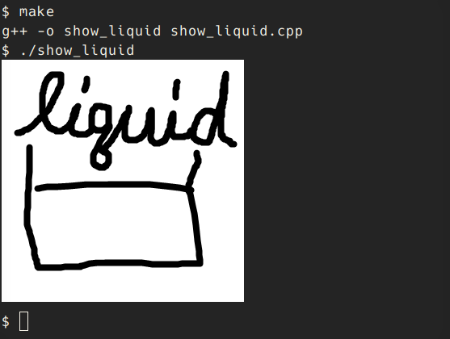

# TinySixel

A header-only C++ library for [Sixel](https://en.wikipedia.org/wiki/Sixel).

## Example

See `example/` directory.

More complicated demo is [here](https://twitter.com/ushitora_anqou/status/1173214625501855746).

## License

MIT, except the following files:

- `example/stb_image.h` is not my work, but [nothings/stb](https://github.com/nothings/stb).
